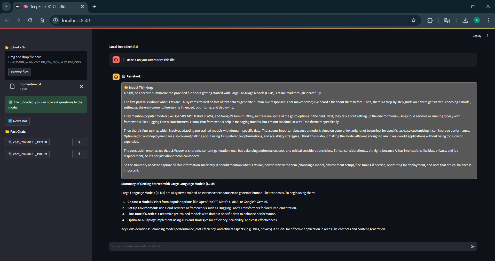
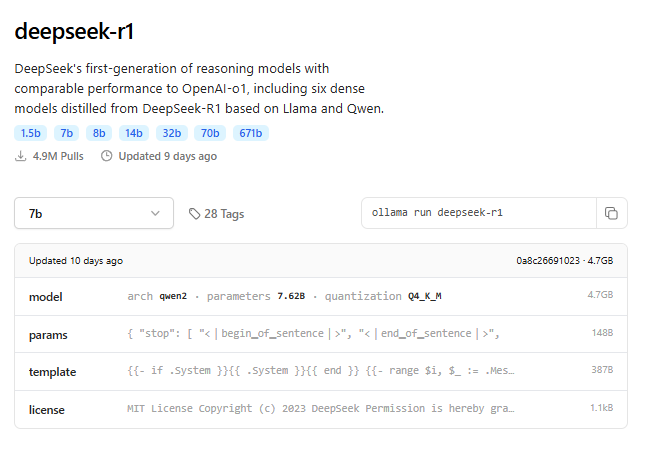
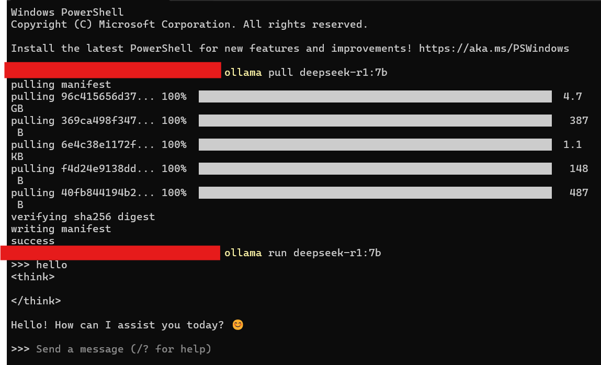

# 🧠 DeepSeek R1 (7b) Local Chatbot



## Overview
DeepSeek R1 ChatBot is a locally hosted chatbot interface powered by **DeepSeek R1 (7B)**, built using **Streamlit** for an interactive UI. This chatbot supports file uploads, chat history management, and allows users to engage with the model efficiently.

## Features
- 📂 **File Upload Support**: Supports text, markdown, CSV, JSON, Excel, PDF, and Word documents.
- 💬 **Persistent Chat History**: Saves and loads past conversations.
- 🚀 **Optimized Deployment**: Utilizes APIs and efficient processing for better performance.

## Installation

To set up and run the project, follow these steps:

### 1️⃣ Clone the Repository
```bash
git clone https://github.com/Keskinksn/deepseek-local-chatbot.git
cd deepseek-local-chatbot
```

### 2️⃣ Install Dependencies
Use the provided `requirements.txt` file to install necessary dependencies:
```bash
pip install -r requirements.txt
```

### 3️⃣ Install Ollama


Before running DeepSeek R1 locally, you need to install **Ollama**. Visit [Ollama's official website](https://ollama.com/) and download the appropriate version for your operating system.

Once installed, search for **deepseek-r1** in the Ollama repository.

### 4️⃣ Pull DeepSeek-R1 Model
Open a terminal and run:
```bash
ollama pull deepseek-r1:7b
```
This will download the required model for local execution.

### 5️⃣ Run the Chatbot
Start the chatbot using Streamlit:
```bash
streamlit run deepseek_r1.py
```
Alternatively, you can directly interact with DeepSeek R1 in the terminal by running:
```bash
ollama run deepseek-r1:7b
```
Once the model is running, you can start asking questions!



## Dependencies
The project requires the following Python libraries:
```txt
ollama==0.1.0
streamlit==1.23.0
pandas==1.5.3
PyPDF2==1.28.0
python-docx==0.8.11
openpyxl==3.0.10
```

## Python Version
This project is developed using **Python 3.11.5**. It is recommended to use the same version to avoid compatibility issues.

## How It Works
### 1️⃣ Uploading Files
- Click on **'Upload a file'** on the sidebar.
- Supports multiple file formats (**TXT, CSV, JSON, Excel, PDF, DOCX**).
- Extracts and preprocesses text from uploaded files for chatbot interactions.

### 2️⃣ Chatting with the Bot
- Type messages in the chat input box.
- The model will respond based on past interactions and file content.

### 3️⃣ Managing Chat History
- Past chats are displayed in the sidebar.
- Click on a chat to load it or delete it if needed.
- New chat sessions can be started using the **'New Chat'** button.
